# Overview

This Project is the Project #2 of the Udacity Azure Dev Ops Nanodegree to product a CI and CD process to deploy a web app through Azure App Services. This project comes with a preconfigred Python Flask app to predict housing prices based on the provided dataset.

# Project Plan

The project plan is very simple for this project and includes links to the Trello board so stalkholders and engineers can see the latest progess.
Link to Trello: [Trello Board](https://trello.com/b/vWRorVRS/flask-sklearn)

Here's a link to the Google Sheets Project plan.
[Google Sheets Project Plan](https://docs.google.com/spreadsheets/d/1qOMtyX2V_MC1RCvzli48WhsdFDQfB0KgAXxGL2PGKnc/edit?usp=sharing)

# Instructions

Architecture Diagram
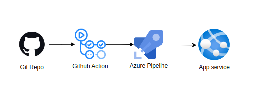
## Azure Cloud Shell Setup
Here's how to get the project running in the Azure Cloud shell. If you're running a linux based System such as Ubuntu or Mac OS then it should be very similar

1. Clone the Github Repo onto your perferred device or if you would perfer you can fork this repo and then clone it to your device.
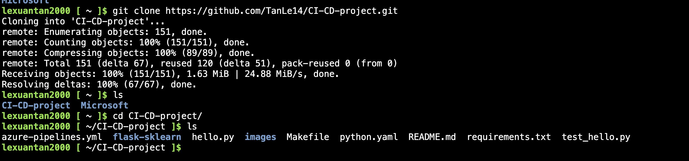

2. Create a python Virtual Environment `python3 -m venv venv`* this will create a virtial environment for your python app so packages and modules are not system wide so you can run many python projects without worrying about conflicts.
3. Activate your neewly created enviroment like so
```
source ~/.venv/bin/activate
```

4. You will then we put into a terminal that is activated to your project like this image.
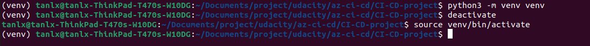

5. Now that the virtual environment is setup and active you can do a `make all` this will install the required modules from the requirements.txt file as well upgrade the pip installer. It will next run the linting step to lint our code and look for any formating and syntax errors as python is an interpreted language. After the linting it will run the testing scripts to test our code. At the end of the command you should be greated by the linting steps and the tests being passed.
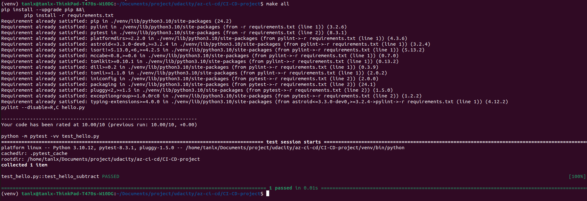


6. Now that all the code is installed and we've run our linting and testing steps now we can test the code locally ourselves. To run the code you can do `python3 app.py` this run our app in the Azure Cloud shell like in the image below
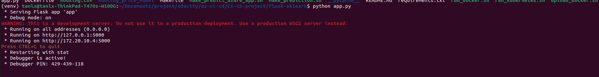 "Output of python app.py"

7. That's it for the Azure Cloud Shell setup, onto the Azure Web App Setup!

## Azure Web App Setup
In this portion of the setup we will configure the Web Application in our Azure Subscription! Super exciting stuff.

1. To create the web app we run this command `az webapp up --sku F1 -l eastus2 -g "Azuredevops" -n "tanlx-sklearn-app"` This create our web app in our newly created resource group, create our all in the East US 2 data center as well as name our application. This also spins up a App Services Plan in the free teir so you are not charged for the usage. This could take some time so make a cup of tea or take a break.
 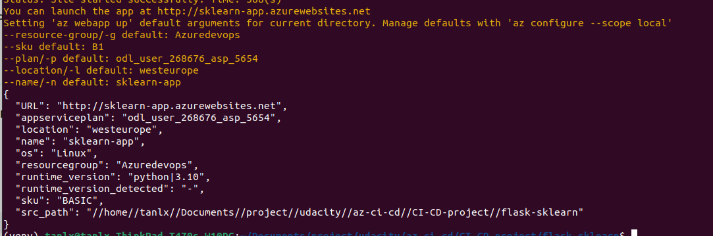


2. Now is the moment of truth, did your app deploy correctly? You can go to your web app through the Azure Portal interface by going to your app and find the URL here. You can also use the `az webapp browse` to launch a browser window to your application.
 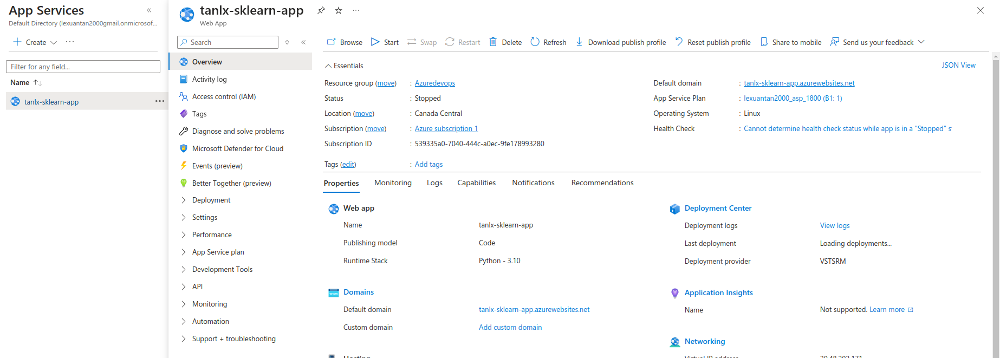

3. `./make_predict_azure_app.sh`
 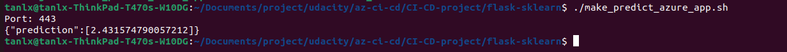

7. If you would to check the logs of your application you can see them using this command should see something like this below. `az webapp log tail -g "{resource-group-name}" -n "{app-name}"`
 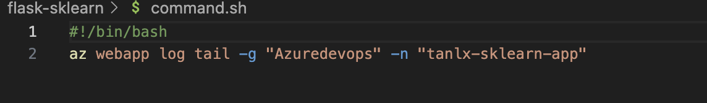

```bash
2021-01-30T22:02:44.432270007Z [2021-01-30 22:02:44,431] INFO in app: JSON payload: %s json_payload
2021-01-30T22:02:44.445898799Z [2021-01-30 22:02:44,445] INFO in app: inference payload DataFrame: %s inference_payload
2021-01-30T22:02:44.450650936Z [2021-01-30 22:02:44,446] INFO in app: Scaling Payload: %s payload
2021-01-30T22:02:44.465779072Z 172.16.0.1 - - [30/Jan/2021:22:02:44 +0000] "POST /predict HTTP/1.1" 200 35 "-" "curl/7.64.0"
```
 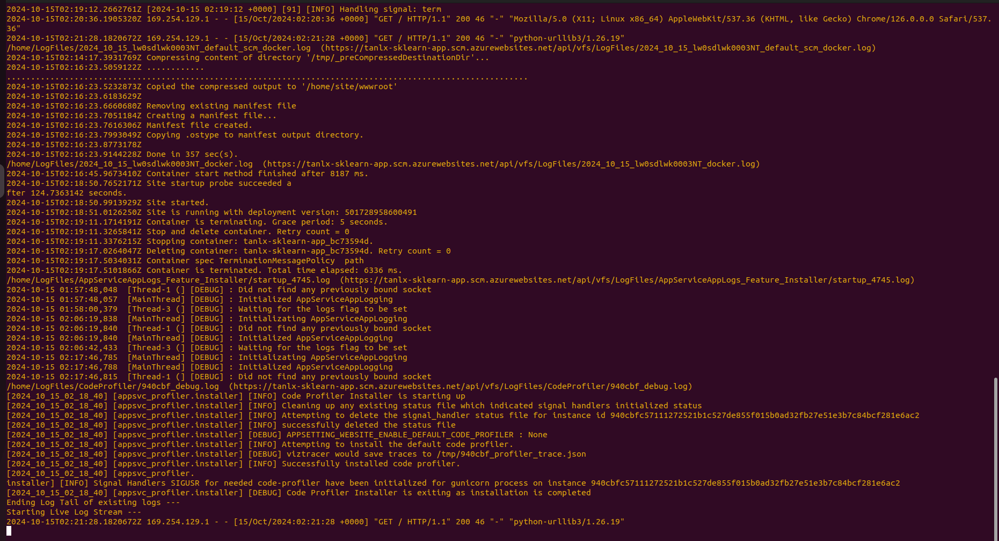

 ## Github Actions Step up
 Github actions should already be setup for this repo but let me show you how to set it up in your repositories for future use. Basically the Github actions will build the environment, lint our code and then test our code when anything is pushed to the master branch.

 1. Login into Github https://github.com/

 2. Locate your Repository you would like to setup Github Actions on.

 3. Located at the top of the repo there is a Actions tab
 You have a choice of tons of already configured github actions to do continious integration tasks or deplying your web app. For now though I'm going to click on the "set up a workflow yourself" link at the top of the page.

 5. You should be now greated by the YAML file editor where you can add sets to the build or new jobs as well. If you have a look at the .github/workflows/main.yml file in this repo you will see that we've setup a simple build step to setup the environment and install dependencies, then to lint our code and install test our code. And current this action runs when any code is pushed to the master branch as well as when there are any pull requests on the master branch as well.

 Here's an example of what a sucessfull Github Action build looks like:\
  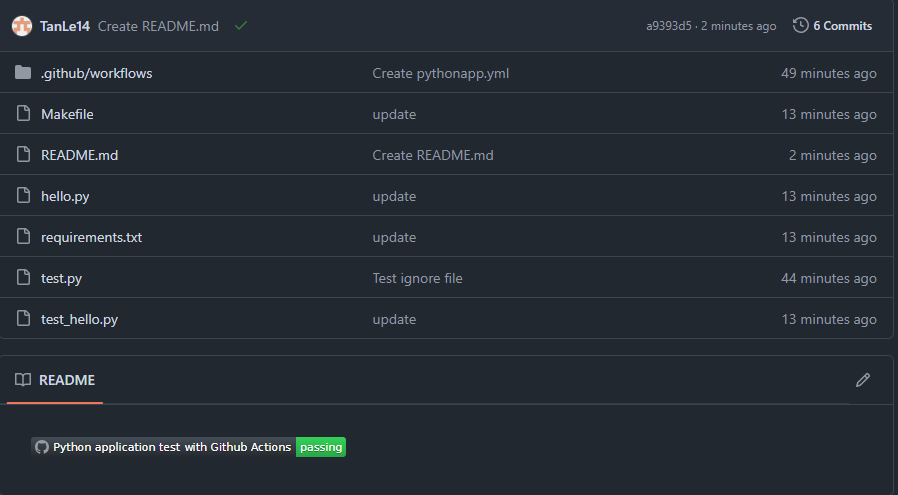

## Azure Pipelines Setup
This will show you show to create a new project in Azure DevOps portal and hook up to your Github account and create a service prinicple.

1. Goto https://dev.azure.com and click on the getting start free, if you don't already have an organization you will be prompted to make one. Once you've created your Azure DevOps account you can go ahead and create a new project.

2. Click on the top right and create a New Project

3. Once your project is created click on your project and select the Pipelines icon on the left had side. You will be prompted to configure where your code is coming from. Go ahead and click on Github, this should prompt you to connect your Github account to the Azure DevOps account. You can then either select if Azure Pipelines should have access to all of your repositories or to only select few. I personally selected only a select few.

4. Once the project is created it will walk you through the steps of selecting your respository, configuring the pipelines YAML file and then checking in the YAML file to your repo and then it will deploy your project to the select Azure resource. Which you can see in the pipelines tab of the Azure DevOps portal.

 Here's an example of what a sucessfull Azure Pipeline looks like:\
  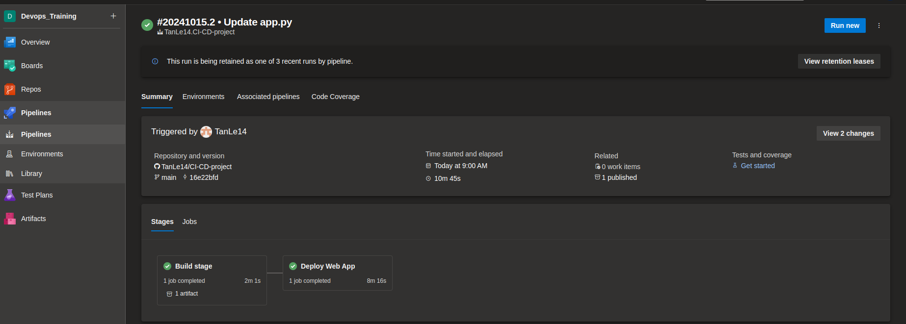
  
5.Github action CI
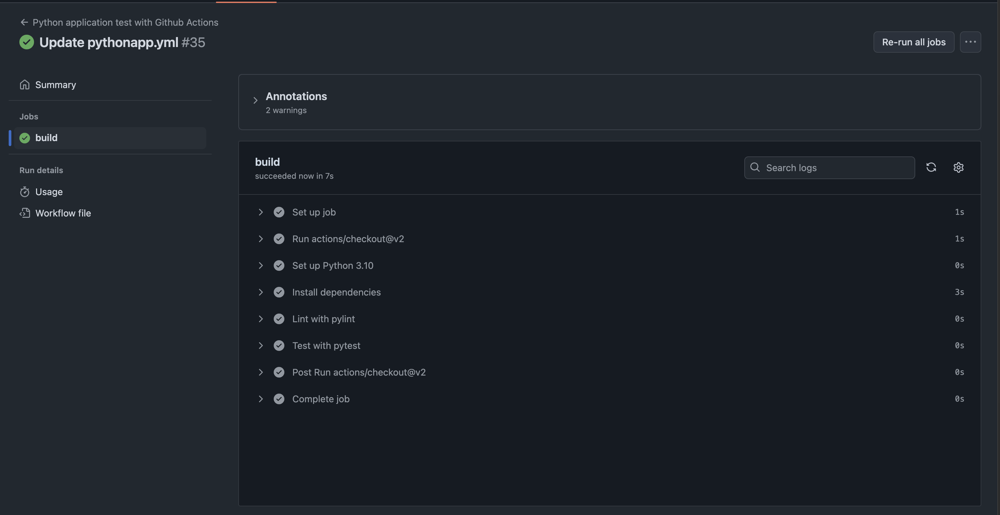

## Enhancements
Here lies a short list of possible future improvements to this project

- Better Tests in the Testing scripts
- Extending the Flask App to have new endpoints
- Adding additional parameters to the predict endpoint
    - Type of Housing (Condo, House, Attached or Dettached housing etc.)
    - Postal Code or Address to help predict closer housing prices in an area
- Flesh out load testing scenarios

## Demo 
Here's a link to the demo on Youtube
https://youtu.be/MiwWNfmz5JA
